# Olá, eu sou Pedro Landim! 👋

🎓 Estudante de Ciência da Computação na UFPE  
💻 Software Developer | Data Engineering  
📍 Recife, PE - Brasil

Atualmente estou direcionando minha carreira para **Engenharia de Dados**, com foco na construção de pipelines, modelagem de dados, bancos de dados e processamento de dados.

Tenho experiência com desenvolvimento de software e venho aprofundando meus conhecimentos em arquiteturas e ferramentas utilizadas no ecossistema de dados.

---

## 🚀 Atualmente estudando

- Engenharia de Dados
- ETL / ELT
- Data Warehouses
- Arquiteturas de Dados
- Docker e ambientes containerizados
- Bancos de dados relacionais
- Pipelines de dados

---

## 🛠️ Tecnologias

### Dados e Backend

### Infraestrutura e Ferramentas

---

## 📊 GitHub Stats

---

## 📫 Contato

📧 **E-mail:** plb3@cin.ufpe.br

💼 **LinkedIn:** (https://www.linkedin.com/in/pedro-landim-de-brito-143236252/)
